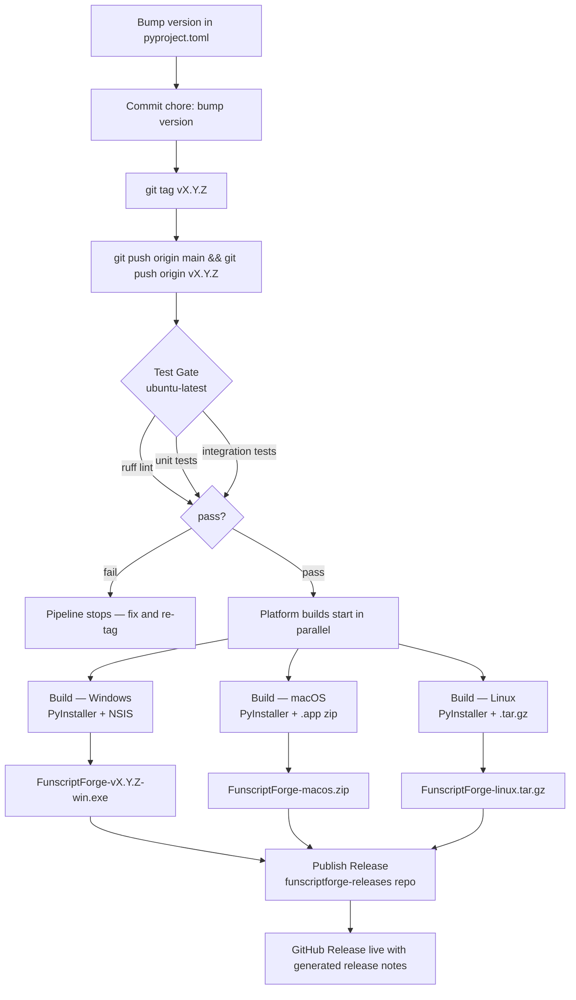

# Contributing to FunscriptForge

## Before your first commit

**Set up SSH, not HTTPS.** HTTPS causes hanging pushes and HTTP 500s on Windows.

```bash
ssh-keygen -t ed25519 -C "your@email.com" -f ~/.ssh/id_ed25519_lqr
# Add ~/.ssh/id_ed25519_lqr.pub to your GitHub account
```

Add to `~/.ssh/config`:

```text
Host github-lqr
  HostName github.com
  User git
  IdentityFile ~/.ssh/id_ed25519_lqr
```

Clone with the alias:

```bash
git clone git@github-lqr:liquid-releasing/funscriptforge.git
```

**Verify your identity before committing:**

```bash
git config user.email   # must be your lqr email, not another identity
git config user.name
```

---

## Secrets — never in the repo

`.env` is gitignored. `.env.example` is committed. Never commit real credentials.

Copy the template:

```bash
cp .env.example .env
# Fill in your local values — this file stays on your machine
```

Secrets in CI go into GitHub Actions Secrets (repo Settings → Secrets). The only
secret currently needed for release:

| Secret           | Purpose                                                    |
|------------------|------------------------------------------------------------|
| `RELEASES_PAT`   | GitHub PAT to publish to `funscriptforge-releases` repo    |

---

## Local dev setup

```bash
pip install -r requirements.txt
pip install -r ui/streamlit/requirements.txt
pip install -r requirements-dev.txt        # ruff, pyinstaller

# Run the app
streamlit run ui/streamlit/app.py

# Run tests
python -m unittest discover -s ui/common/tests -v
python cli.py test

# Lint
ruff check .
```

---

## Branch and commit conventions

- `main` is always deployable — CI must pass
- Use conventional commits: `feat:`, `fix:`, `chore:`, `docs:`, `refactor:`
- Reference issues: `fixes #123`
- No direct pushes to main — PRs only (enforced by branch protection)
- Push frequently — don't let your branch drift more than ~30 commits ahead

---

## Release flow



### Releasing step by step

```bash
# 1. Bump version in pyproject.toml
# 2. Commit:
git commit -m "chore: bump version to 0.0.11"
# 3. Tag and push:
git tag v0.0.11
git push origin main
git push origin v0.0.11
```

The pipeline runs in order:

1. **Test gate** — lint + unit tests + integration tests (Linux, fast)
2. **Platform builds** — Windows (NSIS installer), macOS (.dmg zip), Linux (.tar.gz)
3. **GitHub Release** — artifacts published to `funscriptforge-releases`

If the test gate fails, no builds start. Fix tests before tagging.

---

## Building locally (Windows)

```bat
build.bat
```

Output: `dist\FunscriptForge\FunscriptForge.exe`

To build the NSIS installer locally (requires [NSIS](https://nsis.sourceforge.io/)):

```bat
makensis /DVERSION=0.0.10 installer\funscriptforge.nsi
```

Output: `installer\FunscriptForge-v0.0.10-win.exe`

---

## Identity — if you work on multiple projects

FunscriptForge belongs to the `liquid-releasing` org. Use your lqr identity here.
If you also work on xolvco projects (Carta, stopfires), use `includeIf` in `.gitconfig`
to keep identities separate:

```ini
[includeIf "gitdir:~/Projects/funscript-updater/"]
    path = ~/.gitconfig-lqr
[includeIf "gitdir:~/Projects/funscriptforge/"]
    path = ~/.gitconfig-lqr
[includeIf "gitdir:~/Projects/carta/"]
    path = ~/.gitconfig-xolvco
```

Wrong identity in a commit is a real problem. Check before committing:

```bash
git config user.email
```

---

## Crediting open source authors

FunscriptForge builds on open source work. When you add a dependency or incorporate
code from another project:

- **Dependencies** — listed in `requirements.txt` / `requirements-dev.txt` with version pins.
  Each package's license is its authors' work, not ours.
- **Derived code** — if you adapt an algorithm or non-trivial snippet from another project,
  add a comment at the top of that function or file.

```python
# Adapted from <project name> by <author> — <license> — <URL>
```

- **License compatibility** — FunscriptForge is MIT. Dependencies must be MIT, BSD, Apache 2.0,
  or similarly permissive. Do not add GPL dependencies without checking with the maintainer.
- **NOTICE file** — if a dependency requires attribution in distributions (Apache 2.0),
  add it to `NOTICE` in the repo root.

Key dependencies and their authors:

| Library      | Author / Org                  | License                    |
|--------------|-------------------------------|----------------------------|
| Streamlit    | Snowflake / Streamlit Inc.    | Apache 2.0                 |
| Plotly       | Plotly Technologies           | MIT                        |
| PyInstaller  | PyInstaller Dev Team          | GPL + bootloader exception |
| Pandas       | NumFOCUS / pandas dev team    | BSD 3-Clause               |
| NumPy        | NumFOCUS / NumPy dev team     | BSD 3-Clause               |
| Matplotlib   | Matplotlib dev team           | PSF-based                  |
| ruff         | Astral / Charlie Marsh        | MIT                        |

PyInstaller's GPL applies only to PyInstaller itself — the bootloader exception means
your packaged app is not subject to GPL. No action needed unless you distribute
a modified PyInstaller.
