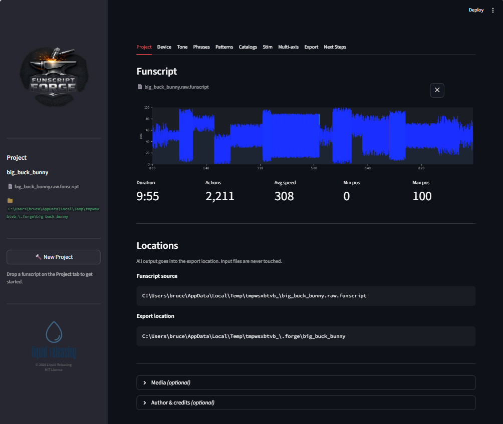

# Forge Your First Funscript

Load a script, pick your device and tone, and export an improved funscript. Four tabs, five minutes.

---

## Before you start

- FunscriptForge is installed and open in your browser ([Install](install.md))
- You have a `.funscript` file on your computer

---

## Step 1 — Create a project

Open the **Project** tab (it's selected by default). Drag and drop your `.funscript` file onto the upload area.

You'll see:

- A **waveform chart** showing the full motion structure
- A **stats row**: duration, action count, average speed, position range


*Drop your funscript and see its motion structure instantly.*

**Export location** is auto-filled based on your filename. Change it if you want.

**Media** (optional) — expand to add your matching video, alternate audio, or captions. FunscriptForge uses these for beat detection and synchronized playback during editing.

Click **Accept**. FunscriptForge analyzes your funscript:

```
Saved to my-scene.forge
Beat data: 142 beats, ~128 BPM
Funscript: 12 phrases, 8 patterns, ~115 BPM
Assessment saved
```

When it finishes, move to the **Device** tab.

---

## Step 2 — Pick your devices

On the **Device** tab, check the devices you own:

- **Mechanical**: The Handy, OSR2/SR6, Intiface (generic)
- **Estim**: Legacy 2b/312, Stereostim, FOC-Stim, NeoStim


*Check your device. FunscriptForge shows its limits and applies a safety backstop.*

FunscriptForge shows a **device limits table** and a **side-by-side preview** (original vs. device-aware). The **Groove** slider adds natural timing variation — 0.35 matches expert hand-scripted scripts.

Click **Accept**. Your funscript is now device-safe.

---

## Step 3 — Choose a tone

On the **Tone** tab, pick how your output should feel. Six tones from softest to most intense:

| Tone | What it does |
| ------ | ------------- |
| **Tender** | Slow, shallow, intimate |
| **Build** | Intensity ramps up over time |
| **Tease** | Rises then pulls back |
| **Edge** | Sustained high intensity |
| **Climax** | Maximum everything |
| **Dominant** | Fast, wide, relentless |


*FunscriptForge suggests two tones. Pick one, or browse all six.*

FunscriptForge suggests a **Best match** and a **Most variety** tone based on your funscript's motion profile. Click a card to read its description, then click **Select**.

Adjust the **Impact** slider if the tone is too strong. The before/after preview updates live.

Click **Accept**.

---

## Step 4 — Export

On the **Export** tab, you'll see:

- **Export preview chart** — your funscript with all changes applied
- **Export options** — blend seams, final smooth, heatmap, audio WAV (if estim selected)
- **Completed transforms** — what you changed (tone in this case)
- **Recommended transforms** — auto-suggestions for individual phrases

For your first export, accept the defaults. Click **Export All**.


*Export writes device-specific files to your output folder.*

FunscriptForge writes a self-contained folder:

```text
{output_folder}/
  myscript.funscript            <- base funscript
  myscript.heatmap.png          <- velocity heatmap
  mechanical/
    myscript.funscript          <- device-safe for Handy / OSR / Intiface
  estim/                        <- only if estim devices selected
    myscript.alpha.funscript
    myscript.beta.funscript
    myscript.legacy.wav         <- ready-to-play audio
    ...
```

Click **Open folder** to see your files. Load the mechanical funscript in your player. Done.

---

## What just happened

In four tabs you:

1. **Loaded** your funscript and ran structural analysis (phrases, patterns, BPM, behavioral tags)
2. **Applied device awareness** — velocity capping, groove, safety backstop
3. **Chose a tone** — shaped the entire funscript's dynamics with one selection
4. **Exported** device-specific files ready for your player

That's the core workflow. For most funscripts, this is all you need.

---

## Going deeper

| I want to... | Go to... |
| --- | --- |
| Edit individual phrases | [Phrase Editor](../guide/phrase-editor.md) |
| Batch-fix all phrases of a type | [Pattern Editor](../guide/pattern-editor.md) |
| Learn every transform | [Transforms](../guide/transforms.md) |
| Generate estim channels | [Stim tab](../guide/stim.md) |
| Add multi-axis motion | [Multi-axis](../guide/multiaxis.md) |
| Understand the vocabulary | [Glossary](../reference/glossary.md) |

---

## Troubleshooting

Something unexpected? [Troubleshoot loading a script](../troubleshooting/loading-a-script.md)
