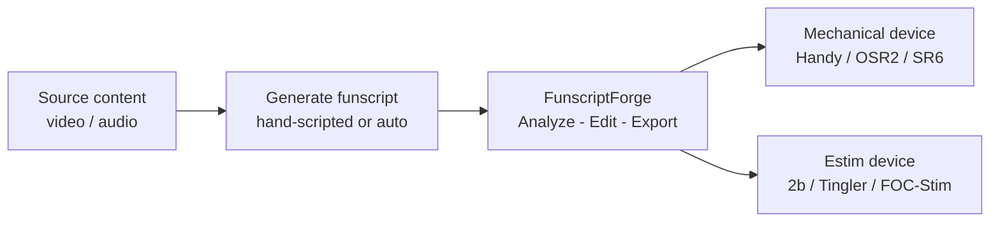

# FunscriptForge — Make Every Script Worth Playing

FunscriptForge is a post-processing tool for funscripts. It takes an existing `.funscript` file — whether hand-scripted, community-downloaded, or auto-generated — and makes it feel better on your device.

It does not generate funscripts from video. It improves the ones you already have.

---

## What is a funscript?

A `.funscript` file is a timed list of position commands for a haptic device. Each command says: *at this moment, move to this position.* The device follows that list in sync with video or audio content.

Quality matters. A good script feels natural and engaging — you forget the device is there. A poor script feels mechanical, monotonous, or jarring. FunscriptForge closes that gap.

---

## Where FunscriptForge fits

FunscriptForge sits between script creation and playback. You bring in a raw funscript; it comes out improved, device-safe, and ready to play.

---

## Why a raw script isn't enough

Most raw funscripts — even well-made ones — share the same problems:

- **Uniform tempo** — same intensity throughout, no dynamics
- **No quiet moments** — everything at full speed, no breathing room
- **Jarring transitions** — sections smash into each other with velocity spikes
- **Off-center strokes** — motion stuck in the top or bottom half of the range
- **Device-unsafe speeds** — commands faster than the hardware can execute

These aren't scripting mistakes. They're things that only become visible when you analyze the motion structure — which is exactly what FunscriptForge does.

---

## What FunscriptForge adds

- **Structure-aware analysis** that finds natural phrases in the motion, detects behavioral problems, and measures tempo across the entire script
- **25 transforms** that add dynamics, smooth transitions, fix centering, and shape intensity — each with live before/after preview
- **Device awareness** that caps velocity for your hardware, adds natural timing variation (groove), and protects against unsafe commands
- **Tone system** — pick one of six moods (Tender through Dominant) and the tool shapes your entire script to match
- **Multi-axis generation** — turn a single-axis stroke script into a full 6-axis experience for OSR2 and SR6
- **Estim audio rendering** — generate ready-to-play stereo WAV files for audio estim devices, no restim setup required
- **Clean export** with device-specific folders, channel files, heatmaps, and a forge log that records every change

<!-- SCREENSHOT: FunscriptForge with a funscript loaded — the Phrases tab showing phrase bands, behavioral tags, and BPM labels. Caption: "Every phrase visible. Every behavior labeled. Every tempo change marked." -->

---

## Who uses FunscriptForge

### Script creators

You hand-script or auto-generate funscripts and want them to feel polished before sharing. FunscriptForge finds the structural problems you can't see by eye — tiny strokes, off-center motion, monotone sections — and gives you one-click fixes for each.

**Key use case:** Load your finished script, run the assessment, fix the flagged phrases, export a device-safe version. 10 minutes instead of an hour of manual tweaking.

### Script consumers

You download community scripts and want them tuned for your device. Different devices have different speed limits and stroke ranges. A script made for OSR2 might overdrive a Handy; a script made for Handy might feel sluggish on SR6.

**Key use case:** Load someone else's script, pick your device on the Device tab, choose a Tone, export. The script is now optimized for your hardware.

### Estim users

You use electrostim devices (2b, 312, Tingler, EstimHero, ZC95, FOC-Stim, NeoStim) and want funscript-synced stimulation. FunscriptForge generates all the channel files and renders stereo audio — so you can play estim in sync with video without setting up restim.

**Key use case:** Load a funscript, select your estim device, pick a stim character (Gentle through Unpredictable), export. You get ready-to-play WAV files and the full set of channel funscripts.

### Multi-axis device owners

You have an OSR2 or SR6 and want more than just stroke. FunscriptForge generates roll, pitch, twist, surge, and sway from your primary stroke data — each phrase gets its own physical position style.

**Key use case:** Load a single-axis script, assign position styles per phrase on the Multi-axis tab, export. Your T-Code player auto-discovers the new axis files.

---

## What you'll learn in this guide

This guide walks you through the full FunscriptForge workflow:

1. **[Install](../01-getting-started/install.md)** — download and launch the app
2. **[Your First Funscript](../01-getting-started/your-first-funscript.md)** — load a script, run the assessment, apply a tone, and export
3. **[Concepts](concepts.md)** — the vocabulary FunscriptForge uses (phrases, behavioral tags, transforms, tones)

Then the per-tab guides go deeper:

- **[Phrase Editor](../phrase-editor.md)** — edit one phrase at a time with transforms and live preview
- **[Pattern Editor](../pattern-editor.md)** — batch-fix all phrases of a given type
- **[Transforms](../transforms.md)** — what every transform does, with before/after charts
- **[Multi-axis](../multiaxis.md)** — generate secondary axes for OSR2 and SR6
- **[Export](../export.md)** — device folders, estim channels, audio WAV, heatmaps

For most users, steps 1-3 are all you need. Load, tone, export, play.

---

## What FunscriptForge does NOT do

- It does not generate a funscript from a video — you need an existing `.funscript` file
- It does not drive your device — use MultiFunPlayer, Intiface, or your device's native app
- It does not require an internet connection — everything runs locally on your machine

---

*Next: [Install FunscriptForge](../01-getting-started/install.md)*

---

*FunscriptForge is made by [Liquid Releasing](https://github.com/liquid-releasing).
Audio synthesis uses math extracted from [restim](https://github.com/diglet48/restim) by diglet48 (MIT license).
Estim channels powered by [funscript-tools](https://github.com/liquid-releasing/funscript-tools) by Lucifie.*
