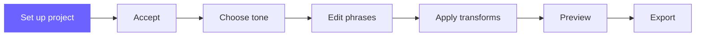

# Set Up Your First Project

**Your journey:**
[Overview](../00-overview/index.md) →
[Install](./install.md) →
**Set up your project** →
[Choose a tone](../02-tone/choose-a-tone.md) →
[Edit phrases](../02-understand-your-script/phrases-at-a-glance.md) →
[Apply transforms](../03-improve-your-script/apply-a-transform.md) →
[Preview](../03-improve-your-script/preview-your-changes.md) →
[Export](../04-export-and-use/export.md)

---

## Overview

In this step you create a project in FunscriptForge, add your funscript and optional
media files, and click **Accept**. FunscriptForge then analyzes everything automatically
and takes you to the Tone tab to choose how your output should feel.

This is the Easy Button: drop your files, click Accept, watch the progress, done.

---

## Prerequisites

- FunscriptForge is installed and running in your browser
  ([Install FunscriptForge →](./install.md) if you have not done this yet)
- A `.funscript` file on your computer
- Optionally: the matching video, audio, or caption file

> **Don't have a funscript?** See the [overview page](../00-overview/index.md) for tools
> that create funscripts from video. Come back once you have a file to work with.

---

## Steps

### 1. Drop your funscript

Open the **Project** tab (it's the first tab, already selected when you launch).
Drag and drop your `.funscript` file onto the uploader area.

You'll immediately see:
- A **waveform chart** showing the full motion structure
- A **stats row**: duration, action count, average speed, position range

> **TODO: insert screenshot — funscript chart and stats row**

---

### 2. Check the export location

FunscriptForge auto-fills an export folder based on your funscript's filename.
The path appears in the **Export location** text box, fully editable.

- To change it: click at the end, backspace, type your project name, done
- To browse: click **Browse…** and pick a folder
- To use a previous project: paste or type the path and click **Set** — if a `.forge` file exists there, FunscriptForge resumes that project

> The output folder is not created yet — nothing is written to disk until you click Accept.

---

### 3. Choose output targets

Check the devices you want to export for. All checked targets are generated at export time:

| Target | Description |
| --- | --- |
| **Estim — FOC** | Single-channel estim. Classic waveform. |
| **Estim — Stereo** | Dual-channel estim. Left/right separation. |
| **The Handy** | Linear stroker. Industry standard. |
| **OSR2** | Multi-axis stroker. Twist + stroke. |

---

### 4. Add media *(optional)*

Expand the **Media** section to add:

- **Source video** — your matching video file. FunscriptForge displays codec, resolution,
  frame rate, and checks whether the duration matches your funscript.
- **Alternate audio** — an optional replacement audio track. If not provided,
  beat data is generated from the video.
- **Captions** — SRT, VTT, or ASS subtitle files for caption display and
  future emotion-aware haptics.

Each file shows metadata stats after upload.

---

### 5. Add author info *(optional)*

Expand **Author & credits** to fill in your name, website, and contributors.
Press **Enter** to move between fields. Click **Save** when done.

---

### 6. Review the summary

The **Summary** section shows a checklist of what's ready:

- ✅ Export location
- ✅ Funscript loaded
- ⬜ Tone applied *(next step)*
- ⬜ Exported *(last step)*

---

### 7. Click Accept

Read the info box — it explains your options. Then click **Accept →**.

FunscriptForge shows you a live progress panel:

```
✅ Saved to my-scene.forge
✅ Beat data: 142 beats, ~128 BPM
✅ Motion heatmap: 298 samples from my-video.mp4
✅ Funscript: 12 phrases, 8 patterns, ~115 BPM (3.2s)
✅ Assessment saved
```

Each step updates in real time so you know exactly what's happening. When it's done,
you're automatically taken to the **Tone** tab.

> **TODO: insert screenshot — Accept progress panel mid-run**

---

## What just happened

When you clicked Accept, FunscriptForge:

1. **Created your output folder** and saved a `.forge` project file
2. **Detected beats** in your audio/video using librosa — tempo and beat timestamps
3. **Analyzed video motion** frame by frame using OpenCV — a motion intensity heatmap
4. **Assessed your funscript** — found phrases, patterns, BPM, and behavioral tags
5. **Saved everything** to your output folder as cached JSON files

All of this runs once and is cached. If you come back to this project later,
FunscriptForge picks up where you left off.

---

## What you'll see on the next tabs

The analysis you just ran powers everything:

- **Tone tab** — choose the feel of your output (the beat data and motion heatmap inform suggestions)
- **Phrases tab** — the phrase structure chart, with every phrase detected and tagged
- **Export tab** — generates device-specific output files

---

Something not working? [Troubleshoot loading a script →](../troubleshooting/loading-a-script.md)

---

## Next step

[Choose a tone →](../02-tone/choose-a-tone.md)

---



*© 2026 [Liquid Releasing](https://github.com/liquid-releasing). All rights reserved.*
