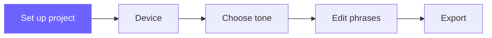

# Set Up Your First Project

**Your journey:**
[Overview](../00-overview/index.md) →
[Install](./install.md) →
**Set up your project** →
[Tone](../tone.md) →
[Export](../export.md)

---

## Overview

In this step you create a project in FunscriptForge, add your funscript and optional
media files, and click **Accept**. FunscriptForge analyzes everything automatically
and you move to the Device tab to make your funscript device-aware.

---

## Prerequisites

- FunscriptForge is installed and running in your browser
  ([Install FunscriptForge →](./install.md) if you have not done this yet)
- A `.funscript` file on your computer
- Optionally: the matching video, audio, or caption file

> **Don't have a funscript?** See the [overview page](../00-overview/index.md) for tools
> that create funscripts from video. Come back once you have a file to work with.

---

## Steps

### 1. Drop your funscript

Open the **Project** tab (it's the first tab, already selected when you launch).
Drag and drop your `.funscript` file onto the uploader area.

You'll immediately see:
- A **waveform chart** showing the full motion structure
- A **stats row**: duration, action count, average speed, position range

---

### 2. Check the export location

FunscriptForge auto-fills an export folder based on your funscript's filename.
The path appears in the **Export location** text box, fully editable.

- To change it: click at the end, backspace, type your project name, done
- To browse: click **Browse…** and pick a folder
- To use a previous project: paste or type the path and click **Set** — if a `.forge` file exists there, FunscriptForge resumes that project

> The output folder is not created yet — nothing is written to disk until you click Accept.

---

### 3. Add media *(optional)*

Expand the **Media** section to add:

- **Source video** — your matching video file. FunscriptForge displays codec, resolution,
  frame rate, and checks whether the duration matches your funscript.
- **Alternate audio** — an optional replacement audio track. Beat data is
  generated from video by default.
- **Captions** — SRT, VTT, or ASS subtitle files for caption display and
  future emotion-aware haptics.

Each file shows metadata stats after upload.

---

### 4. Add author info *(optional)*

Expand **Author & credits** to fill in your name, website, and contributors.
Press **Enter** to move between fields. Click **Save** when done.

---

### 5. Review the summary

The **Summary** section shows a checklist of what's ready:

- ✅ Export location
- ✅ Funscript loaded
- ⬜ Tone applied *(later step)*
- ⬜ Exported *(last step)*

---

### 6. Click Accept

Click **Accept**. FunscriptForge shows a live progress panel:

```
✅ Saved to my-scene.forge
✅ Beat data: 142 beats, ~128 BPM
✅ Motion heatmap: 298 samples from my-video.mp4
✅ Funscript: 12 phrases, 8 patterns, ~115 BPM (3.2s)
✅ Assessment saved
```

Each step updates in real time. When it's done, a message tells you:
**"Your next step in the workflow is the Device tab."**

---

## What just happened

When you clicked Accept, FunscriptForge:

1. **Created your output folder** and saved a `.forge` project file
2. **Detected beats** in your audio/video using librosa
3. **Analyzed video motion** frame by frame using OpenCV
4. **Assessed your funscript** — found phrases, patterns, BPM, and behavioral tags
5. **Saved everything** to your output folder as cached JSON files

All of this runs once and is cached. If you come back to this project later,
FunscriptForge picks up where you left off — just select it from the
**Recent Projects** dropdown in the sidebar.

---

## The workflow

The sidebar shows your progress through the workflow:

```
✅ Project  ⬜ Device  ⬜ Tone  ⬜ Phrases  ⬜ Export
```

Each tab builds on the previous tab's output. You can undo any step
from the sidebar and redo it with different settings.

**Tab order:**

| Tab | What it does |
| --- | --- |
| **Project** | Set up your funscript, media, and export location |
| **Device** | Make your funscript safe for your target device |
| **Tone** | Choose how your output feels — the creative decision |
| **Phrases** | Fine-tune individual sections (optional for most users) |
| **Patterns** | Batch-fix all phrases of a given behavioral tag |
| **Catalogs** | Reference guide for all transforms and behaviors |
| **Stim** | Configure estim channels (estim devices only) |
| **Multi-axis** | Generate secondary axes for OSR2/SR6 (optional) |
| **Export** | Generate device-specific output files |
| **Next Steps** | Playback guides, credits, community links |

For most users, the path is: **Project → Device → Tone → Export**. Four clicks.

---

## Next step

[Tone →](../tone.md)

---



*© 2026 [Liquid Releasing](https://github.com/liquid-releasing). All rights reserved.*
