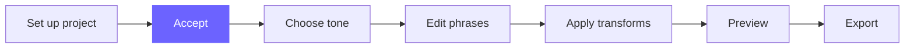
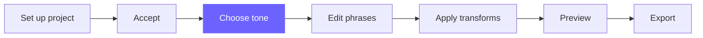
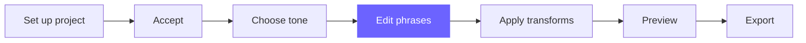
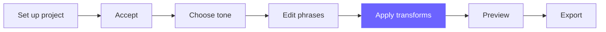
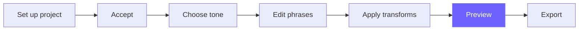

# Journey Map — Canonical Reference

> This file defines the task-based journey map used as a footer on every tutorial page.
> Copy the appropriate version (with the correct node highlighted) into each page.
> Do not render this file directly.

---

## The journey (7 tasks)

```
Set up your project → Accept → Choose a tone →
Edit phrases → Apply transforms → Preview → Export
```

---

## Mermaid snippets — one per page

### 01-getting-started/your-first-funscript.md  (Set up your project)


### 01-getting-started/accept.md  (Accept)


### 02-tone/choose-a-tone.md  (Choose a tone)


### 02-understand-your-script/phrases-at-a-glance.md  (Edit phrases)


### 03-improve-your-script/apply-a-transform.md  (Apply transforms)


### 03-improve-your-script/preview-your-changes.md  (Preview)


### 04-export-and-use/export.md  (Export)

