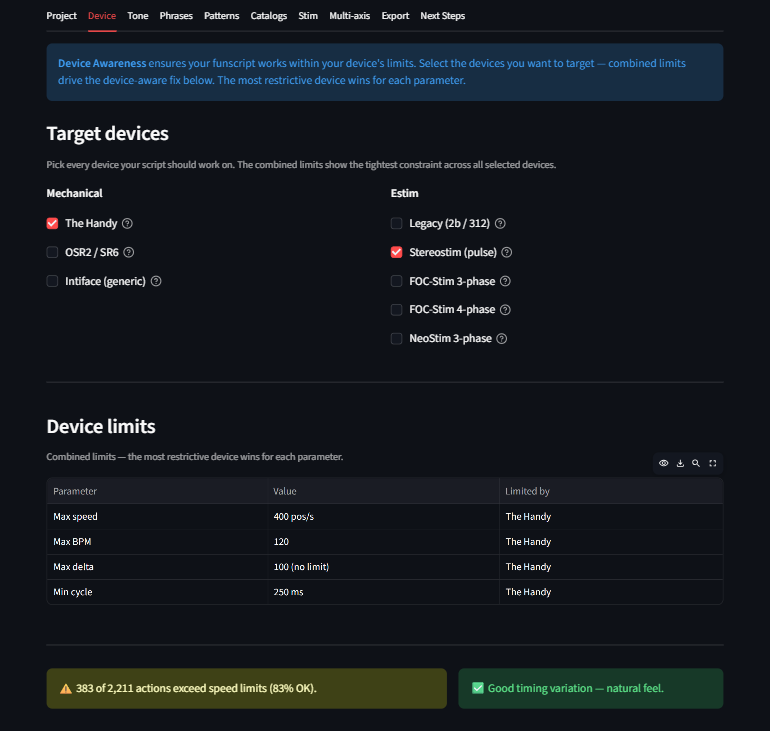
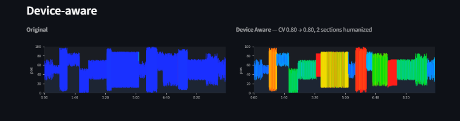
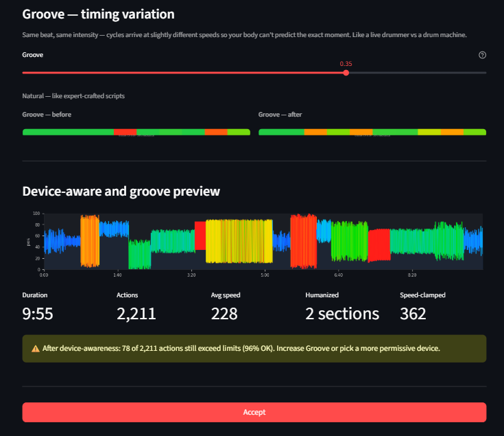

# Device

The Device tab makes your funscript safe and natural-feeling for your target hardware. Select your devices, see what needs fixing, adjust the groove, and accept.

Everything downstream — Tone, Phrases, Export — works on the device-aware baseline. You don't need to think about device limits again after this tab.

---

## Target devices

Two columns of checkboxes. Pick every device your script should work on.

### Mechanical

| Device | Speed | Description |
| --- | --- | --- |
| **The Handy** | 400 pos/s | Linear stroker. Industry standard. |
| **OSR2 / SR6** | 500 pos/s | Multi-axis servo. Depends on build. |
| **Intiface (generic)** | 300 pos/s | Conservative limit for Bluetooth devices (Lovense, Kiiroo, etc.) |

### Estim

| Device | Speed | Description |
| --- | --- | --- |
| **Legacy (2b / 312)** | 500 pos/s | Continuous waveform audio device |
| **Stereostim (pulse)** | 600 pos/s | Pulse-based. Tingler / EstimHero / ZC95 |
| **FOC-Stim 3-phase** | 700 pos/s | Direct current protocol device |
| **FOC-Stim 4-phase** | 700 pos/s | Experimental. Same hardware as 3-phase |
| **NeoStim 3-phase** | 550 pos/s | Protocol device. Limited docs — estimate only |

When multiple devices are selected, the **combined limits** use the most restrictive value for each parameter. The Handy at 400 pos/s is typically the bottleneck.

*Combined limits show which device is the bottleneck for each parameter.*

---

## Device limits table

Shows four parameters for the combined device set:

| Parameter | What it means |
| --- | --- |
| **Max speed** | Maximum velocity in positions per second. Actions faster than this are clamped. |
| **Max BPM** | Maximum oscillation rate the device can sustain. |
| **Max delta** | Maximum position change between consecutive actions. 100 = no limit. |
| **Min cycle** | Shortest allowable cycle duration in milliseconds. |

The **Limited by** column shows which device is the bottleneck for each row.

---

## Analysis

After selecting devices, FunscriptForge analyzes your funscript for two things:

### Speed violations

How many actions exceed the device speed limits. Shown as a count and percentage:

- **All within limits** — no changes needed for speed
- **N actions exceed limits** — those actions will be clamped during the device-aware fix

### Stingy detection (monotone analysis)

Checks whether the funscript has mechanical, monotone timing:

- **Monotone detected** (>50% of sections) — the funscript needs groove to add natural variation
- **N% monotone sections** (30-50%) — groove can improve the feel
- **Good timing variation** (<30%) — the funscript already has natural timing

Stingy detection measures three things: CV (coefficient of variation in cycle timing), build ratio (does intensity escalate?), and quiet windows (are there any rest periods?).

---

## Side-by-side preview

A before/after comparison shows the original funscript and the device-aware version:

- **Original** — the raw funscript as loaded
- **Device Aware** — after humanization and speed clamping, with CV improvement stats

*Device awareness adds timing variation (groove) and caps unsafe velocities.*

---

## Groove — timing variation

The **Groove** slider controls how much natural timing variation is added to each cycle. The device still hits the same positions at the same intensity — but cycles arrive at slightly different speeds so your body can't predict the exact moment.

| Value | Label |
| --- | --- |
| 0.00 | Mechanical — every cycle identical |
| 0.15 | Light groove |
| 0.30 | Natural feel |
| **0.35** | **Natural — like expert-crafted scripts** (recommended) |
| 0.45 | Jazzy — loose, unpredictable |
| 0.50 | Maximum variation |

Think of it as the difference between a drum machine and a live drummer. Same beat, different feel.

### CV heatmap strips

Below the groove slider, two heatmap strips show the coefficient of variation across the funscript — **before** and **after** groove. Brighter segments have more timing variation; dark segments are mechanical.

*CV heatmaps show timing variation. Dark = mechanical. Bright = natural.*

---

## Verification

After the device-aware fix, a verification section shows:

- **Avg speed** — average velocity after the fix
- **Humanized** — how many sections were modified by groove
- **Speed-clamped** — how many actions were velocity-capped

If more than 50% of actions are clamped, a warning appears suggesting you may want to opt out of clamping (see below).

---

## Clamping opt-out

A checkbox at the bottom lets you **skip speed clamping** for scripts authored for faster hardware. Use this when you know your device can handle the velocities in the script and clamping would degrade the experience.

Groove is always applied regardless of the clamping opt-out.

---

## Intensity spikes (estim)

When estim devices are selected, an **Intensity spikes** setting controls how many full-range cycles are allowed through unclamped. Options: None, Rare, Moderate, Frequent. This lets occasional peak-intensity moments pass through the safety backstop for dramatic effect.

---

## Accept

Click **Accept** to save the device-aware funscript to the chain. All downstream tabs (Tone, Phrases, Export) will work on this baseline.

After Accept, a success message directs you to the **Tone** tab.

---

## Related

- [Tone](tone.md) — the next tab in the workflow
- [Device Safety](../reference/device-safety.md) — detailed explanation of groove vs speed clamp
- [Device Limits](../reference/device-limits.md) — per-device speed and BPM specifications with sources
- [Glossary](../reference/glossary.md) — groove, device safety, velocity definitions
