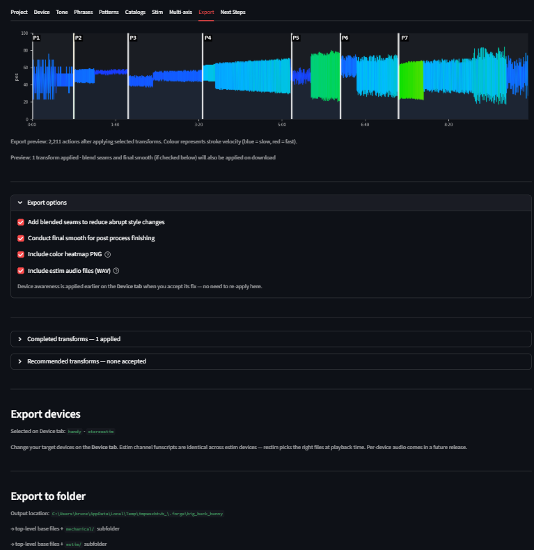

# Export

The Export tab is the last stop in the FunscriptForge workflow. It writes the final funscript — and any estim channel files — into your output folder, organized into subfolders by device class.

---

## Layout


*The Export tab. Pick devices, review the preview, then Export All.*

The tab is laid out top-to-bottom in the order you read it:

1. **Export preview chart** — what the final funscript will look like with every accepted transform applied.
2. **Export options** *(collapsed)* — three optional passes: blend seams, final smooth, device awareness.
3. **Completed transforms** *(collapsed)* — every transform you applied in the Phrase Editor or Pattern Editor.
4. **Recommended transforms** *(collapsed)* — auto-suggested transforms for phrases you have not edited.
5. **Export devices** — pick which devices you want files for. **Mechanical** is one checkbox; **Estim** is five.
6. **Export to folder** — the **Export All** button and the **Open folder** button.

---

## Export preview chart

A static visualization of your funscript with every transform applied. This is what will be written to disk. The chart updates automatically as you accept, reject, or edit transforms in the expanders below it.

---

## Export options

Checkboxes, all on by default:

| Option | What it does |
| --- | --- |
| **Blend seams** | Detects high-velocity jumps at phrase boundaries and applies targeted smoothing only at those seams. Recommended when adjacent phrases use different transform styles. |
| **Final smooth** | A light global smoothing pass that removes residual sharp edges. |
| **Include color heatmap PNG** | Writes a velocity-colored heatmap of the main funscript next to the export. |
| **Include estim audio files (WAV)** | Renders stereo audio from the estim channel funscripts. Only visible when an audio-capable device is selected (legacy or stereostim). Play these WAV files directly on your estim device — no restim required. |

---

## Completed transforms

Every transform you applied in the Phrase Editor or Pattern Editor, in order.

| Column | What it shows |
| --- | --- |
| # | Phrase number |
| Time | Start time of the phrase |
| Dur (s) | Phrase duration |
| Transform | The transform applied |
| Source | PE (Phrase Editor) or PP (Pattern Editor) |
| BPM | BPM if relevant |
| Cycles | Cycle count if relevant |
| 🗑 | Reject this transform from the export |

Rejecting a completed transform does **not** undo your editing work — it just excludes it from this export. You can restore it with the ↩ button.

---

## Recommended transforms

FunscriptForge suggests transforms for every phrase you have not manually edited, based on the phrase's behavioral tag and BPM.

| Suggestion logic | Transform suggested |
| --- | --- |
| Pattern label contains "transition" | Smooth |
| BPM below the BPM threshold | Passthrough (no change) |
| BPM at or above threshold, amplitude span < 40 | Range (fit to content) |
| BPM at or above threshold | Amplitude Scale |

You can accept all recommendations at once, or review each one. Clicking **✏ Edit** on a recommendation opens that phrase in the Phrase Editor so you can choose something different.

---

## Export devices

Two groups of checkboxes:

### Mechanical

A single **Mechanical** checkbox covering The Handy, OSR2, and Intiface-compatible Bluetooth devices (Lovense, Kiiroo, etc.). All three load the same single 1D funscript, so there is one checkbox to enable the whole group. Velocity limits used by the device-aware passes come from The Handy (the most restrictive of the three).

### Estim

Five separate checkboxes, one per estim device class:

| Checkbox | Device class |
| --- | --- |
| **Audio 3-phase — continuous (legacy 2b/312)** | Legacy 2b / 312, continuous sine carrier waveform |
| **Audio 3-phase — pulse (Tingler/EstimHero/ZC95) — default** | Tingler, EstimHero, ZC95, and other pulse-based stereo stim |
| **FOC-Stim — 3-phase** | FOC-Stim three-phase mode |
| **FOC-Stim — 4-phase** | FOC-Stim experimental four-phase mode |
| **NeoStim — 3-phase** | NeoStim three-phase mode |

The channel funscripts in `estim/` are identical regardless of which estim device you check — funscript-tools produces all channel files and your estim software picks the ones it needs at playback time.

**Audio-capable devices** (legacy 2b/312 and stereostim Tingler/EstimHero/ZC95) also get **stereo WAV files** rendered from the alpha/beta channel funscripts. These are ready-to-play audio files — connect your estim device to your audio output and hit play. No restim required.

**Protocol devices** (FOC-Stim 3-phase, FOC-Stim 4-phase, NeoStim) do not use audio files. They need **restim** for real-time device control. The exported channel funscripts are what restim loads — see the Next Steps tab for setup instructions.

---

## Export to folder

Click **Export All** and FunscriptForge writes a self-contained folder you can drop into your media player.

### Folder layout

The output folder is organised **one folder per device**, with a generated
`README.txt` listing what was actually written — so it never describes files
that are not there.

For a project named `myscript`:

```text
{output_folder}/myscript.output/
  myscript.funscript      ← universal stroke script; works with most 1-axis players
  README.txt              ← plain-English "grab this for your device"
  manifest.ffmeta         ← what produced this, and from what
  E-Stim/                 ← the e-stim channel set — restim or ForgePlayer
  FOC-Stim/               ← same channels, clamped for FOC-Stim
  FOC-Stim 4-phase/       ← four per-electrode channels (e1–e4)
  Handy/                  ← clamped stroke script
  OSSM/                   ← clamped stroke script
  MultiFunPlayer/         ← multi-axis set; point MultiFunPlayer at this folder
  Lovense/  Vacuglide/    ← clamped stroke scripts
  Bass Shaker/            ← low-frequency intensity envelope
  Edger/                  ← myscript.events.yml
  Preview/                ← waveform + frame thumbnails
```

Only folders with files in them are created, and each is described in
`README.txt`.

Choosing a different export folder still writes into a `myscript.output`
sub-folder inside it — an export never scatters loose files across a folder you
picked, or over your originals.

### Stim audio is for E-Stim only

`stim.wav` / `stim.mp3` are **opt-in** export options, and they are produced
only for **E-Stim**.

restim is driven *by sound*: it plays the alpha/beta pair out of your sound
card, which is the only reason a stim audio file exists at all. FOC-Stim speaks
its own protocol and reads the channel funscripts directly, so nothing would
play a stim track for it. Stamp only FOC-Stim and no audio is rendered — the
Export card reports `audio: n/a` rather than promising files that never arrive.

### How device files are produced

Two paths, and the only difference is whether you visited Polish:

1. **You stamped a station in Polish** — those files are used as authored, with
   the settings you approved.
2. **You skipped Polish** — every station is generated at its **default**
   settings. Skipping means *accepting the defaults*, not *getting nothing*:
   you still get E-Stim, both FOC-Stim stations, the strokers and the shaker.

Experimental stations are generated **conservatively**. FOC-Stim ships a higher
rate ceiling than the flagship and labels it *unverified*; auto-generation caps
it at the proven ceiling, so an unverified limit never reaches someone who did
not choose it. Stamp the station deliberately and you get its own default.

**Two stations need data you may not have.** The e-stim channel set is built
from the **Character** assigned to each chapter, and the multi-axis set from
each chapter's **Mechanical style**. Without those, no files are produced for
them — silently, because there is nothing to report. If an export has no e-stim
files, that is almost always why: assign Characters on the Channels tab.

Stations needing only the motion track — the per-device stroker clamps and the
shaker envelope — are always generated.

### Open folder

Once Export All completes, **Open folder** opens the output folder in your OS file manager.

---

## The forge log

The main funscript includes a `_forge_log` key in its JSON metadata recording every transform that was applied:

```json
"_forge_log": {
  "version": "0.1.0",
  "exported_at": "2026-04-11T10:23:45",
  "source": "myscript.funscript",
  "transforms": [
    {
      "phrase_index": 3,
      "at_ms": 84300,
      "transform": "amplitude_scale",
      "params": {"scale": 1.4},
      "source": "phrase_editor"
    }
  ],
  "blend_seams": true,
  "final_smooth": true,
  "clamp_count": 0
}
```

This log travels with the file so you always know what was done to it.

---

## Workflow templates

The `.forgetmpl` file written next to your funscript is a reusable record of the *decisions* you made — tone settings, output targets, device fix strategies, history — without any project-specific data (no paths, no timestamps). Drop it into a new project to start with the same workflow.

---

## Audio synthesis

FunscriptForge renders stereo WAV audio files from the alpha/beta channel funscripts using 3-phase synthesis math extracted from [restim](https://github.com/diglet48/restim) by diglet48 (MIT license).

Two waveform modes match two device families:

| WAV file | Waveform | Devices |
| --- | --- | --- |
| `{stem}.legacy.wav` | Continuous sine carrier | 2b, 312, and similar legacy audio devices |
| `{stem}.stereostim.wav` | Pulse train with cosine envelope | Tingler, EstimHero, ZC95, and similar modern audio devices |

**How to use**: Connect your audio estim device to your computer's audio output (or a dedicated audio interface). Play the WAV file in any media player — the audio IS the stimulation signal. Sync with video using MultiFunPlayer or ScriptPlayer.

**Protocol devices** (FOC-Stim, NeoStim) generate stimulation signals in their own firmware and do not use audio files. Use restim for real-time device control with the exported channel funscripts.

---

## Related

- Stim tab — choose a character preset; channel files reuse your preset at Export time
- Device tab — see the device limits and device-aware corrections that the Export options apply
- [Phrase Editor →](phrase-editor.md) — fix individual phrases
- [Pattern Editor →](pattern-editor.md) — fix all phrases of a given type
- [Transforms →](transforms.md) — what every transform does
