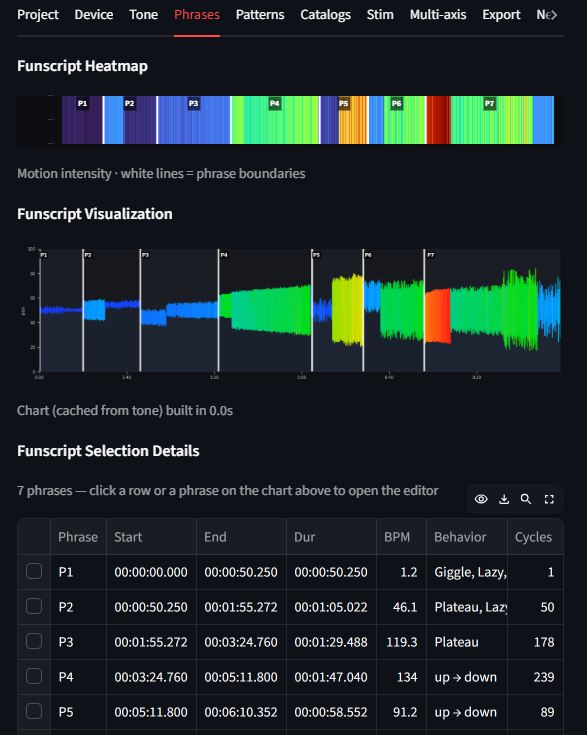
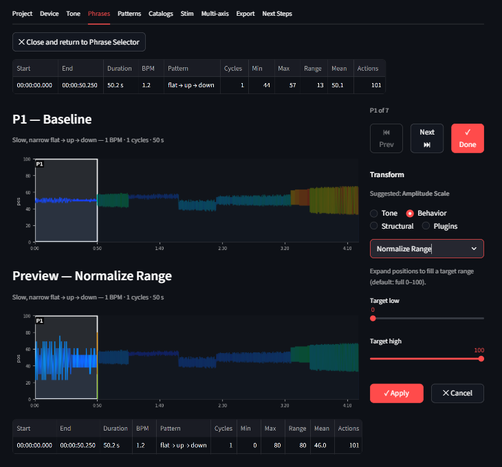

# Phrase Editor

The Phrase Editor is where you improve individual phrases. Every phrase in your funscript can be opened here, given a transform, tuned with live sliders, and accepted or rejected before anything changes in your output.

---

## Opening the Phrase Editor

From the **Phrases** tab:

- Click any phrase band on the chart
- Or click any row in the phrase table

The tab switches from Phrase Selector view to Phrase Editor view.


*Click any phrase band on the chart to open it in the Phrase Editor.*

---

## Layout

The Phrase Editor has two columns:

```
[ Charts (3/4)           ] [ Transform controls (1/4) ]
[   Baseline chart       ] [   Transform dropdown     ]
[   Preview chart        ] [   Parameter sliders       ]
```


*The Phrase Editor. Baseline on top, live preview below. Controls on the right.*

**Baseline chart** — the phrase after all previously accepted transforms (or the original if this is the first edit). Context on either side is dimmed so focus stays on the current phrase.

**Preview chart** — updates live as you move sliders. Shows what the phrase will look like with the current transform applied on top of the baseline. If you select Passthrough and have a chain, the preview is hidden since there's nothing new to show.

**Transform controls** — dropdown to select a transform, parameter sliders for that transform.

---

## Choosing a transform

Open the transform dropdown and select any transform. The sliders below update to show the parameters for that transform with their default values. Transforms are grouped into categories: Tone, Behavior, Structural, and Plugins.

See [Transforms →](transforms.md) for a full description of every transform and what it does.

---

## Tuning with sliders

Move any slider and the preview chart updates in real time. The preview reflects your current transform on top of the baseline.

If the preview looks wrong, move the slider back or choose a different transform.

## Transform chaining

You can apply multiple transforms to the same phrase. After accepting a transform (via navigation or the Apply button), the baseline updates to include your change. Select another transform and it stacks on top.

The header shows how many transforms are in the chain: **"Baseline (3 accepted)"**. Each accepted transform is permanent for this editing session. Use **Ctrl+Z** to undo the last accepted transform.

---

## Device awareness

Device awareness is applied globally on the **Device tab** before you reach the Phrase Editor. All transforms in the Phrase Editor work on the already device-aware baseline — you don't need to think about device limits here. Every creative change you make is guaranteed to work on your selected devices.

---

## Buttons

Two rows of buttons control the workflow:

**Navigation row:**

| Button | What it does |
| --- | --- |
| **⏮ Prev** | Auto-accepts current transform, opens the previous phrase |
| **Next ⏭** | Auto-accepts current transform, opens the next phrase |
| **✓ Done** | Auto-accepts current transform, saves all phrase edits to chain, returns to Phrase Selector |

**Save/Cancel row:**

| Button | What it does |
| --- | --- |
| **✓ Apply** | Accepts the current transform and stays on this phrase — use this to chain multiple transforms |
| **✕ Cancel** | Discards ALL changes for this phrase (reverts to the state when you opened it) |

Navigation buttons (Prev, Next, Done) all auto-accept. **Apply** is for chaining — accept one transform, pick another, apply again. Cancel undoes everything since you opened this phrase.

---

## Batch editing by tag

To apply the same transform to all phrases that share a behavioral tag, use the [Pattern Editor](pattern-editor.md). The Phrase Editor is for individual phrase work; the Pattern Editor is for batch operations.

---

## Media player (optional)

If you have loaded a media file (audio or video) in the sidebar, a player column appears to the right of the charts. It plays only the current phrase — automatically looping within the phrase boundaries so you can hear or see what you are editing in context.

<!-- SCREENSHOT: Phrase Editor with the media player column visible. The player shows a waveform or video thumbnail. Caption: "With a media file loaded, the player restricts playback to the current phrase so you can edit in context." -->

Use the **📹 Hide/Show player** toggle above the charts to collapse the player column if you need more space.

---

## Phrase information

At the top of the Phrase Editor you can see:

- Phrase number and time range (`1:24.3 – 1:51.7`)
- Duration
- BPM
- Behavioral tag(s)
- Cycle count and oscillation count

This tells you what kind of phrase you are working with before you choose a transform.

---

## Related

- [Transforms →](transforms.md) — what every transform does
- [Pattern Editor →](pattern-editor.md) — edit all phrases of a given tag at once
- [Export →](export.md) — review all transforms and download
- [Behavioral Tags →](../reference/behavioral-tags.md) — what the tags mean and what to do about them
