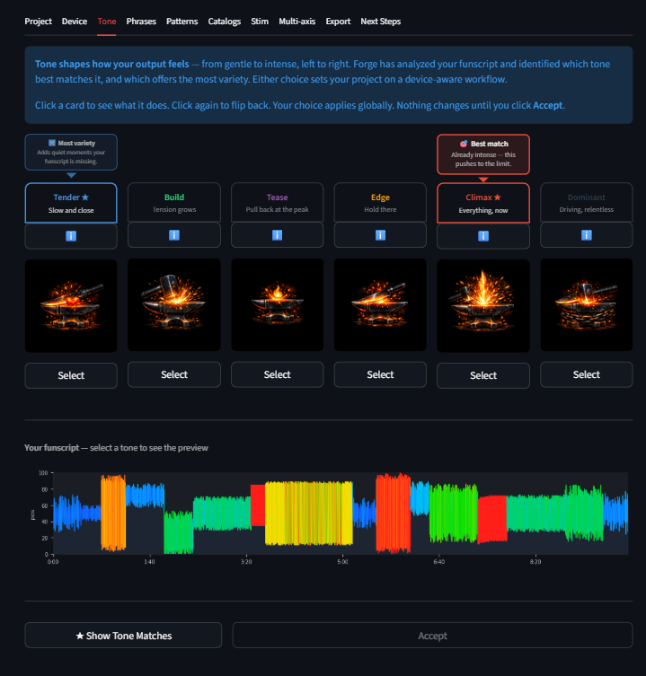
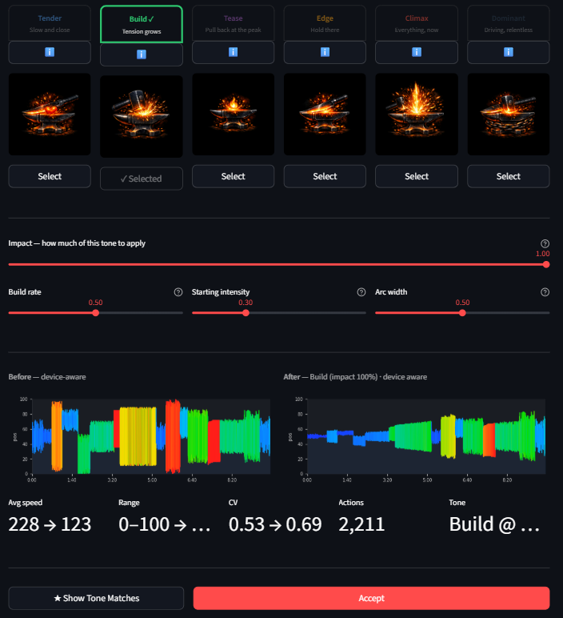

# Tone

The Tone tab is the easy button. Pick a mood, and FunscriptForge shapes your entire funscript to match — without touching the underlying structure.

For most users, this is the most important tab. Choose a tone, accept, export. Done.

---

## The six tones

Six tones, ordered from softest to most intense. Each one changes how transforms are applied globally.

| Tone | Tagline | What it does |
|------|---------|-------------|
| **Tender** | Slow and close | Soft, slow, shallow strokes. Intimate and present. Beat influence stays low so rhythm fades into the background. For quiet moments and slow scenes. |
| **Build** | Tension grows | Intensity starts low and climbs phrase by phrase. Beat influence grows with it — early sections barely pulse, later sections drive hard. For scenes that escalate. |
| **Tease** | Pull back at the peak | Intensity rises toward a peak, then retreats before the payoff. Beat influence oscillates — you feel the rhythm arrive and disappear. For edging and denial content. |
| **Edge** | Hold there | Intensity locks at a high level and holds. No ramp, no retreat — sustained pressure. Beat influence stays strong until the end of each phrase. For sustained tension. |
| **Climax** | Everything, now | Full power, full stroke range, urgent pacing. Every beat hits hard. For peak moments, finales, and scenes where restraint is wrong. |
| **Dominant** | Driving, relentless | Fast, wide, assertive. The device leads and the user follows. Relentless rhythm, no breaks. For content where the scene is in control. |

*Six tones from Tender to Dominant. Suggestion bubbles highlight the best match and most variety.*

> **Looking to calm something down, not reshape it?** The six tones above all *reshape the feel* of your script. If instead you just need to remove motion that's too fast for your device to play cleanly, that's a job for the **Tame** transform — a gentle corrective applied per phrase or stanza, not a global tone. See [Tame →](transforms.md#tame). This is an edge case; most scripts never need it.

---

## Card interaction

Each tone is a flippable card:

- **Front**: colored icon and tagline
- **Back**: full description of what the tone does to your funscript

Click the info button to flip between icon and description. Click **Select** to choose that tone.

Nothing changes until you click **Accept** at the bottom of the tab.

---

## Tone suggestions

When you first open the Tone tab, FunscriptForge analyzes your funscript and suggests two tones:

- **Best match** — the tone closest to your funscript's existing character. Enhances what's already there.
- **Most variety** — the tone farthest from your funscript's character. Adds contrast and dynamics your script doesn't have.

Suggestion bubbles appear above the cards with colored arrows pointing to the recommended tones. If your funscript is monotone (>50% of phrases share the same behavioral tag), the Variety suggestion is highlighted as primary.

You can always ignore the suggestions and pick any tone.

<!-- Suggestion bubbles are visible in the cards screenshot above -->

---

## Impact slider

Once you select a tone, the **Impact** slider appears:

- **1.0** = full tone effect (default)
- **0.0** = no change (original funscript)

Dial it back if the tone feels too severe. This scales the entire tone effect proportionally.

---

## Per-tone sliders

Below the Impact slider, each tone has its own contextual controls. These are the parameters with the most audible effect for that tone — derived from sensitivity testing.

| Tone | Sliders |
|------|---------|
| **Tender** | Softness (range compression), Pulse onset (how gradually pulses rise) |
| **Build** | Build rate, Starting intensity, Arc width |
| **Tease** | Retreat depth, Oscillation speed, Pulse variety |
| **Edge** | Hold intensity, Drop point (how late intensity drops) |
| **Climax** | Peak intensity, Urgency, Pulse sharpness, Frequency push |
| **Dominant** | Drive, Sweep width, Relentlessness |

Sliders default to values that work well for most scripts. Adjust them if you want to fine-tune the effect.

---

## Before / After preview

Below the sliders, a side-by-side chart shows:

- **Before** — the funscript after the Device tab (or the original if you skipped Device)
- **After** — the funscript with the selected tone applied

The preview updates live as you change the tone or adjust sliders.

*The preview updates live as you select a tone and adjust sliders.*

---

## Device awareness

Tone transforms are **re-clamped to your device limits** after application. If you selected devices on the Device tab, the tone output stays within those safe limits. You don't need to worry about a tone pushing velocity past what your hardware can handle.

---

## Workflow

1. Open the Tone tab (requires Project Accept first)
2. Read the suggestion bubbles or browse all six cards
3. Click a card's info button to read its description
4. Click **Select** on the tone you want
5. Adjust the **Impact** slider and per-tone sliders if needed
6. Review the Before/After preview
7. Click **Accept** to apply the tone globally

After Accept, move to Phrases (for per-phrase editing) or skip straight to Export.

---

## Related

- [Concepts](00-overview/concepts.md) — what phrases and behavioral tags are
- [Phrase Editor](phrase-editor.md) — fine-tune individual phrases after applying a tone
- [Export](export.md) — export with the tone applied
- [Glossary](../reference/glossary.md) — full term definitions
